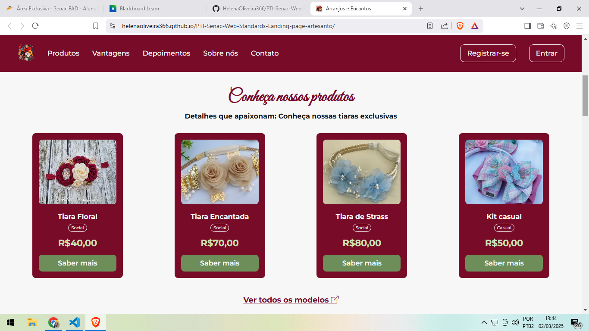

# Arranjos e Encantos

> Web Standards - PTI - Senac EAD

[Acesse o projeto AQUI](https://helenaoliveira366.github.io/PTI-Senac-Web-Standards-Landing-page-artesanto/)

A página "Arranjos e Encantos" é uma landing page desenvolvida como parte do Projeto de Trabalho Individual (PTI) para a disciplina de Web Standards do curso de Análise e Desenvolvimento de Sistemas do Centro Universitário Senac. Este projeto visa aplicar os padrões web formalizados pelo W3C, garantindo a criação de websites de qualidade e universalmente acessíveis. 

O site apresenta uma loja virtual especializada na venda de tiaras artesanais para crianças, destacando-se pela personalização dos produtos, facilidade de pagamento, entrega rápida e programa de cashback. Além disso, a página inclui seções de depoimentos de clientes, informações sobre a empresa e um formulário de contato, proporcionando uma experiência completa ao usuário.

> ## Tecnologias usadas
>
> HTML5
> - Cabeçalhos
> - Parágrafos
> - Imagens
> - Links
> - Navbar
> - Formulário
>
> CSS3
> - Flexbox
> - Grid
> - Responsividade
> - Media query e breakpoints

> ## Imagens da Landing Page
> 
> 
> 
> 
> 
> 
> 
